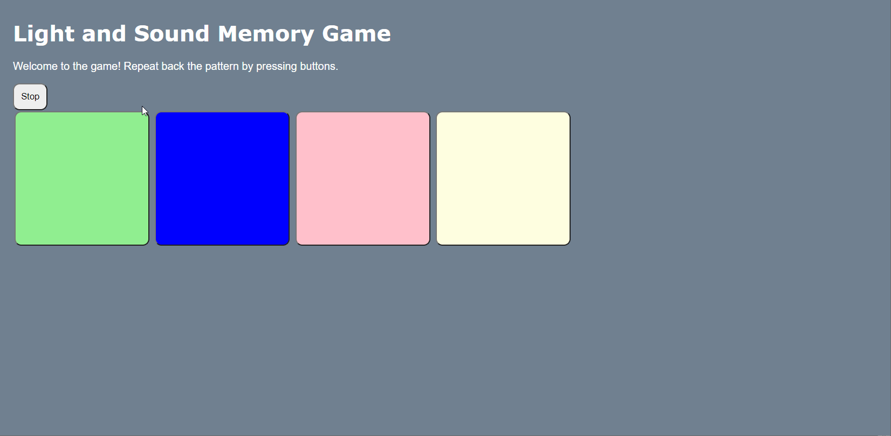
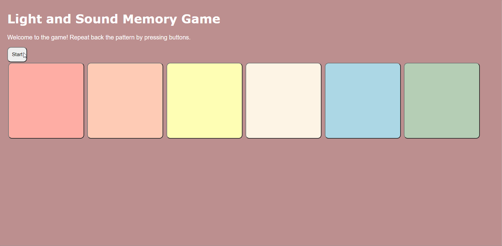

# Pre-work - *Memory Game*

**Memory Game** is a Light & Sound Memory game to apply for CodePath's SITE Program. 

Submitted by: **Liza Feng**

Time spent: **4** hours spent in total

Link to project: https://glitch.com/edit/#!/kaput-gelatinous-eclipse

## Required Functionality

The following **required** functionality is complete:

* [x] Game interface has a heading (h1 tag), a line of body text (p tag), and four buttons that match the demo app
* [x] "Start" button toggles between "Start" and "Stop" when clicked. 
* [x] Game buttons each light up and play a sound when clicked. 
* [x] Computer plays back sequence of clues including sound and visual cue for each button
* [x] Play progresses to the next turn (the user gets the next step in the pattern) after a correct guess. 
* [x] User wins the game after guessing a complete pattern
* [x] User loses the game after an incorrect guess

The following **optional** features are implemented:

* [x] Any HTML page elements (including game buttons) has been styled differently than in the tutorial
* [x] Buttons use a pitch (frequency) other than the ones in the tutorial
* [x] More than 4 functional game buttons
* [ ] Playback speeds up on each turn
* [ ] Computer picks a different pattern each time the game is played
* [x] Player only loses after 3 mistakes (instead of on the first mistake)
* [ ] Game button appearance change goes beyond color (e.g. add an image)
* [ ] Game button sound is more complex than a single tone (e.g. an audio file, a chord, a sequence of multiple tones)
* [ ] User has a limited amount of time to enter their guess on each turn

The following **additional** features are implemented:

- [ ] List anything else that you can get done to improve the app!

## Video Walkthrough (GIF)

If you recorded multiple GIFs for all the implemented features, you can add them here:
1. Required features only

2.Different look & sound, 2 more buttons, and 3 strikes before game over: 
2a. Using all 3 strikes and losing

2b. Winning the game

## Reflection Questions
1. If you used any outside resources to help complete your submission (websites, books, people, etc) list them here. 
[YOUR ANSWER HERE]

2. What was a challenge you encountered in creating this submission (be specific)? How did you overcome it? (recommended 200 - 400 words) 
    One of the biggest challenges I had encountered while creating this submission was time because I took on a handful of coding classes and I would struggle to balance all the projects. For the time being, my plan is to do the basics of the website first so that I do not have to worry about the deadline. Then I would be able to explore more of web-development when the time sensitive things are in the way. I was also struggling with the colors on the buttons not displaying and I couldn't figure out why because the website would display and not really tell you if something went wrong. This was corrected by a classmate who pointed out that I had a space between some characters which caused the button to be not referenced correctly.

3. What questions about web development do you have after completing your submission? (recommended 100 - 300 words) 
I wonder what other games can I put on the website? What are some other ways I can make the website more interactive? How can I make a login system so that users can come back to their accounts? How can I make a game where there is a character on screen that can jump and interact with things around them? Could I make a game that is interactive and encourages players to donate money to fundraisers (if the website leaves an impression or impact then people might feel like supporting the cause that the website was made for). What other ways can web development be made more interactive other than a game? What are the copyright laws for website? How do you design an aesthetic website? 

4. If you had a few more hours to work on this project, what would you spend them doing (for example: refactoring certain functions, adding additional features, etc). Be specific. (recommended 100 - 300 words) 
I think that if I had a few more hours to work on the project, I would add difficulty levels so that the user can choose the amount of buttons as well as how many tries they have until it is game over. If I had a few weeks more to learn, I would have a point system where they can save their progress and then when they reach a certain level, they could compete for a position on the leaderboard.The leaderboard would have the best time for each amount of buttons. I would like to change the look of the website so that it displays beginner, average, or expert mode and when the user clicks on one,
it would bring them to a screen with a certain amount of buttons. There could be points and the user can use it to unlock other websites or games that I created. Those other websites would only be unlocked if you spent points on the first game I created (with the help of codepath's guide), it would be like a fun puzzle game in a way. It would also encourage kids to play this more often and train their memory because they want to unlock another game.

## Interview Recording URL Link

[My 5-minute Interview Recording](your-link-here)

## License

    Copyright [Liza Feng]

    Licensed under the Apache License, Version 2.0 (the "License");
    you may not use this file except in compliance with the License.
    You may obtain a copy of the License at

        http://www.apache.org/licenses/LICENSE-2.0

    Unless required by applicable law or agreed to in writing, software
    distributed under the License is distributed on an "AS IS" BASIS,
    WITHOUT WARRANTIES OR CONDITIONS OF ANY KIND, either express or implied.
    See the License for the specific language governing permissions and
    limitations under the License.
